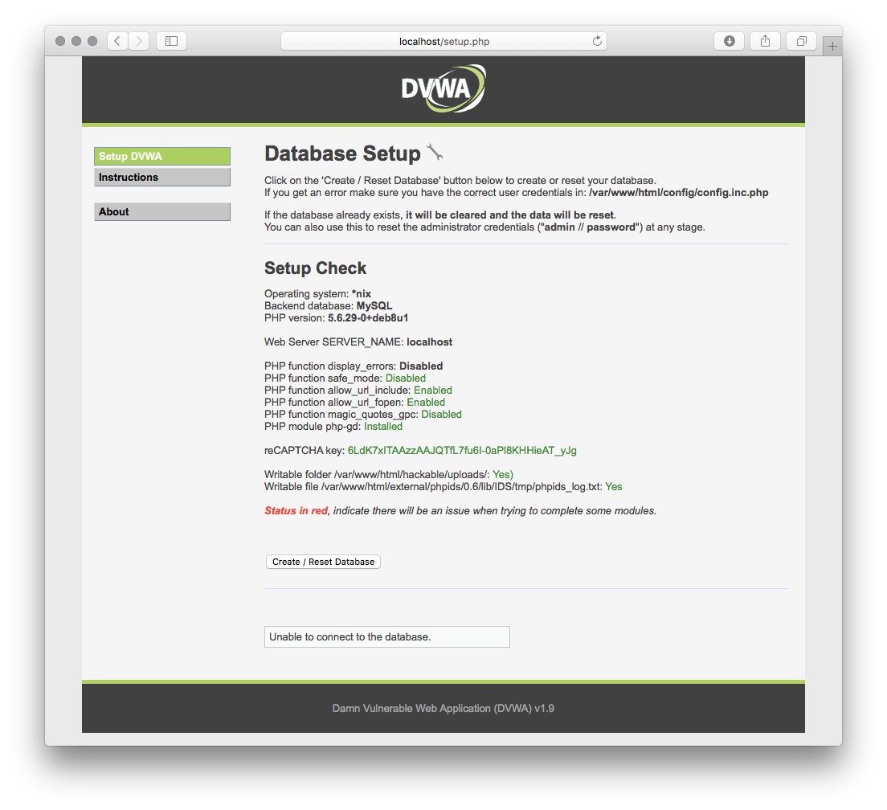
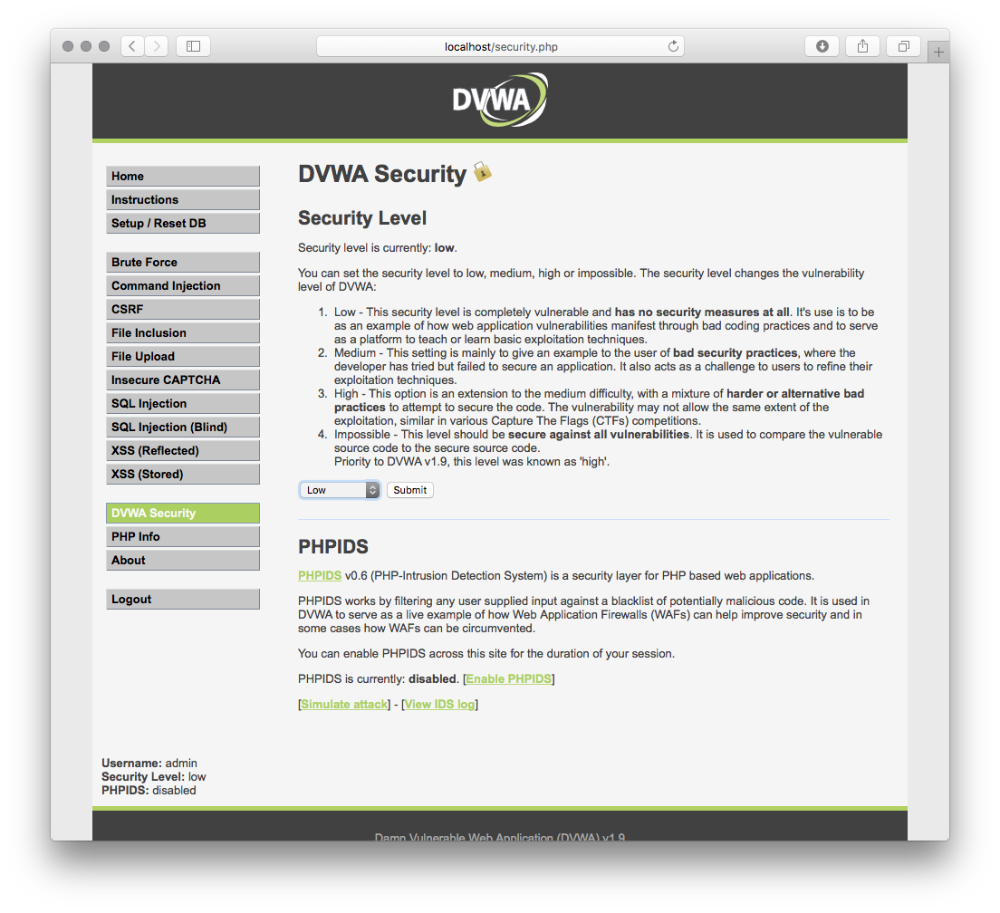

#  Docker Containers 

The Capture the Flag project is going to be built with multiple containers with vulnerabilities that a student can access via the Kubernetes front in. 

## Vulnerable SSH Container

One of the containers contains an SSH service that is weak against brute force attacks. Download the image by running:

    docker pull ajhanna/vuln-ssh

The image will be downloaded to your local repository. You can run the container with different flags to fit your need. An example of this command is as follows:
    
    docker container run -p 22:22 -d ajhanna/vuln-ssh

The docker container will now start and any traffic pointed at port 22 will be routed to the container.

**Warning** : If you already have SSH on your machine then docker can not use that port at the same time. Therefore you you need to run docker on a different port on your local machine. Use a port not being used by you local machine and configure that to route back to 22 within the conatiner. For example: 
    
    docker container run -p 25:22 -d ajhanna/vuln-ssh

You can BruteForce the SSH server with Hydra via the command line with the wordlist in the folder.

    hydra -t 50 -V -f -s 25 -L admin -P 10-million-password-list-top-1000.txt ssh://<ip address>

## Vulnerable FTP Container

This container is an FTP server that allows anonymous login. The flag is only reachable via anonymous login. Pull the image with:

    docker pull ajhanna/vuln-ftp

The image will be downloaded to your local repository. You can run the container with different flags to fit you need. An example of this command is as follows:

    docker container run -p 21:21 -p 20:20 -p 13450-13500:13450-13500 -d ajhanna/vuln-ftp

**Warning** : If you already have FTP on your machine then docker can not use that port at the same time. Therefore you you need to run docker on a different port on your local machine. Use a port not being used by your local machine and configure that to route back to 21 or 20 within the container. For example:

    docker container run -p 27:21 -p 28:20 -p 14450-14500:13450-13500 -d ajhanna/vuln-ftp

Now you can log in with the anonymous user via web browser, terminal, or client like Filezilla

## Vulnerable Web Application (DVWA)

The container contains a dockerized version of the Dam Vulnerable Web Application. This web application has many challenges that are built into the machine. Students will visit the website and create a container and create the database.

Once the database is created you can log in with the following credentials:

    Username: admin
    Password: password

Finally, start the challenges on the left side of the screen and screenshot any that were successful. There is a flag in the home directory of the root user. Shell access is the ultimate goal here.

